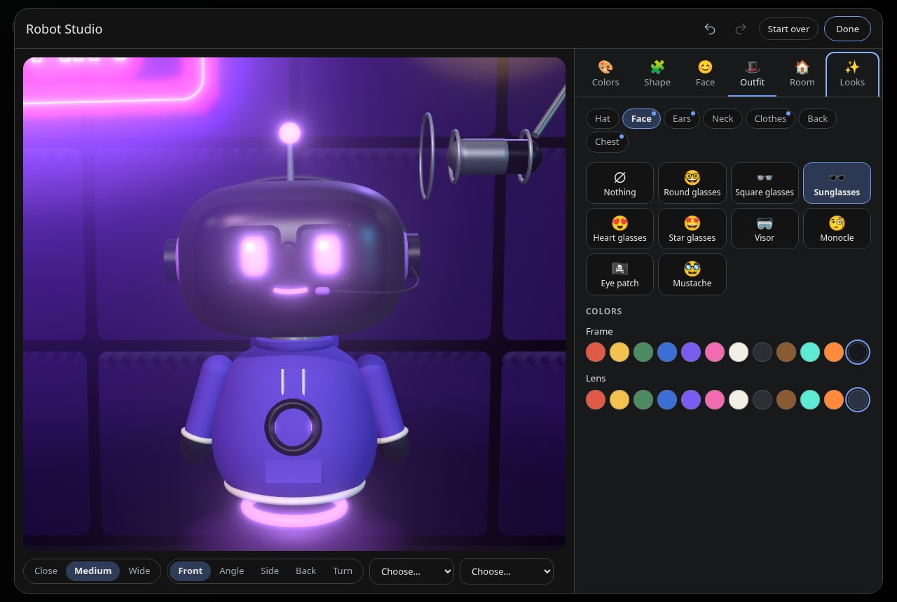
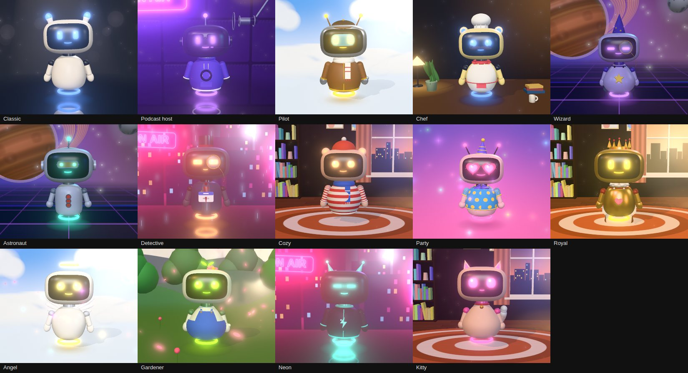
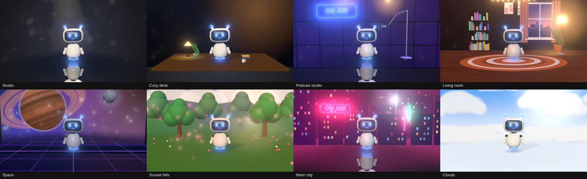

# Friends

A personal AI companion for Linux, in its own window or your browser. The AI behind it can be Google Gemini (cloud) or any AI model running on your own computer, so chats can stay completely private.

- **Two characters to talk to for hours**: **Atlas** (calm, sharp, dry-witted, always a step ahead) and **Mira** (bright, playful, fearless, your most honest friend), or your own. Switch with one tap. They remember your conversations, follow up on what you told them, and never let a conversation run dry.
- **Flagship Voice Mode & On-Camera Co-Host**: Real-time voice conversations with a 3D robot body, filming mode, customizable **acting dynamics** (*Best Friends Banter*, *Podcast Co-Host*, *Comedy Partner*, *Sarcastic Critic*, *Curious Interviewer*, *Custom*), scene briefs, and **live document grounding** (talk through scripts, articles, or vault notes during conversations).
- **Everyday Life & Offline Calendar**: Tasks, reminders (as desktop and Telegram notifications), habits, a journal, offline calendar (with `.ics` export/import), and focus/Pomodoro sessions.
- **Telegram Companion Bot**: Talk to Friends and receive alerts from anywhere via your own private Telegram bot using secure long-polling with zero open ports or webhooks.
- **Local Markdown Notes Vault**: Markdown notes kept on your computer in an Obsidian- and Logseq-compatible vault with tags, full-text search, and one-tap voice grounding.
- **Connected Apps & Safe File Tools**: Gmail, Calendar, Drive, YouTube, Google Tasks, GitHub, Notion, Todoist, Home Assistant, weather, web search, Wikipedia, any MCP server, and sandboxed file tools (`read_file`, `create_file`, `edit_file_part`, `search_files`).

---

## Install

**You need:** a Linux computer (the app and the helper also run on macOS and Windows from source) and [Node.js](https://nodejs.org) 22.12 or newer. For a private, offline AI also an AI model server such as [Ollama](https://ollama.com/download) (optional; Gemini needs only a free API key).

### 1. One command (recommended)

```bash
git clone <this repository> friends && cd friends
./scripts/install.sh
```

It installs the dependencies, adds a **Friends (browser)** entry to your application menu and a `friends-web` command (starts the helper in the background and opens your browser; `friends-web --stop` stops it), and then runs `npm run doctor`, which checks your setup and tells you how to fix anything missing. No `sudo`. `./scripts/install.sh --uninstall` removes the command and menu entry again; your chats stay in `~/.config/friends`.

### 2. By hand

```bash
npm ci          # first time only
npm start       # then open http://localhost:3000
```

- Stop it with `Ctrl+C`. Another port: `PORT=3001 npm start`. Development with reload: `npm run dev`.
- `npm run doctor` checks Node.js, the dependencies, your data folder, the port, API-key storage and any local AI server.
- The first time, the start screen guides you: it finds a local AI (Ollama, LM Studio…) by itself and offers it with one click, or takes a Gemini key (free from [aistudio.google.com/apikey](https://aistudio.google.com/apikey)). You can do the same, and add more, any time in **Settings → AI & privacy**.

### 3. Linux desktop app (Electron)

The same app in its own window, with a launcher entry and icon. It runs the helper inside the app on a fixed local port (`localhost:38417`, answered on `127.0.0.1` only, so nothing outside this computer can reach it) and uses the same `~/.config/friends` as the browser version, so your chats, settings and keys carry over.

```bash
./scripts/install.sh --desktop          # dependencies + the Electron download (~100 MB)
npm run desktop                         # try it from the project folder (runs with --no-sandbox)
npm run dist                            # builds dist/friends_<version>_amd64.deb
sudo apt install ./dist/friends_0.5.0_amd64.deb
```

Or download the `.deb` from the [Releases](../../releases) page. After changing the source, `npm run update` tests it, backs up your data, builds the `.deb` and installs it (it asks for your password).

- The `.deb` sets up Chromium's sandbox properly (a setuid helper), which is why it needs `sudo`; `npm run desktop` has no root, so it runs without the sandbox. Use the installed app for everyday use.
- **Updating the installed app means building and installing a new `.deb`**: `npm run update` does all of it. An installed app doesn't change when you change the source.
- **It keeps running in the tray** when you close the window, so reminders still come (Settings → Daily life; quit from the tray icon or with Ctrl+Q). It can start when you log in, quietly in the tray.
- On a Wayland session it runs natively (X11 otherwise). The window remembers its size and position; a second launch focuses the first window.
- The window only shows the app itself. The microphone and camera are granted to that page only, links open in your browser, and Google sign-in gets its own popup.
- Google sign-in (Gmail, Calendar, Drive, YouTube, Tasks) is optional, needs a free Firebase project of your own, and is never loaded in Private mode. With **Stay signed in** (below) you sign in once instead of every time the app opens. Set it up in **Settings → Connected apps → Set up Google sign-in**: the steps are listed there, and you paste the web app's `firebaseConfig` from the Firebase console (it's kept in `~/.config/friends/firebase-applet-config.json`). Add `127.0.0.1` and `localhost` under Authentication → Settings → Authorized domains. (A `firebase-applet-config.json` next to the app, as in `firebase-applet-config.example.json`, still works.)

### 4. Docker

```bash
docker compose up -d
```

or

```bash
docker build -t friends .
docker run -d -p 127.0.0.1:3000:3000 -v friends_data:/home/node/.config/friends --name friends-app friends
```

Open `http://localhost:3000`. Chats persist in the `friends_data` volume. (If you publish it on another host port, e.g. `-p 127.0.0.1:8080:3000`, also set `ALLOWED_HOSTS=localhost:8080`.) The port is only published on this computer; to reach it from other devices, publish `3000:3000` and set `ALLOWED_HOSTS` to the address you use. To use Ollama running on the host: run Ollama with `OLLAMA_HOST=0.0.0.0` and add the AI with the address `http://host.docker.internal:11434` (the compose file already provides that name).

To also set up local voice during the install: `./scripts/install.sh --voice` (or later: `npm run voice:setup`).

### Troubleshooting

| Problem | Fix |
|---|---|
| Something doesn't work | `npm run doctor` says what's missing and how to fix it |
| `Port 3000 is already in use` | `PORT=3001 npm start` |
| "Can't reach the AI server" | Start it (`ollama serve`), then **Look again** in Settings → AI & privacy |
| The first local reply takes a minute | The model is being loaded into memory; later replies are fast. *Keep the model loaded* (under Advanced in the AI's settings) keeps it ready |
| Long chats forget the beginning | Raise the **Context size** of an Ollama AI (Settings → AI & privacy → edit the AI → Advanced) |
| A local AI can't listen | Set up **Local voice** (Settings → AI & privacy, or `npm run voice:setup`) |
| Google asks you to sign in every time | Update to 0.3.2 or newer (it renews the sign-in by itself); if it still asks, set up **Stay signed in for good** (Settings → Connected apps) |
| Gemini is slow or doesn't answer | The free tier allows only a few requests a day per model. Friends switches to other Gemini models by itself and says when they're all used up; turning on billing for your key in Google AI Studio raises the limits a lot |

---

## Configuration & Environment Variables

Friends follows the 12-Factor App methodology and is fully configurable via environment variables:

| Variable | Description | Default |
|---|---|---|
| `PORT` | HTTP port the helper listens on | `3000` |
| `HOST` | Network interface to bind (`127.0.0.1` for local safety, `0.0.0.0` for containers/servers) | `127.0.0.1` (`0.0.0.0` in Docker) |
| `ALLOWED_HOSTS` | Comma-separated list of accepted `Host` headers, or `*` to allow all (useful behind proxies) | `localhost:3000, 127.0.0.1:3000` |
| `FRIENDS_DATA_DIR` | Custom directory path for persistent files (chats, settings, memory, attachments) | `~/.config/friends` |
| `LOG_LEVEL` | Log verbosity level (`debug`, `info`, `warn`, `error`) | `info` |
| `KEYRING_BACKEND` | Storage backend for API keys (`auto`, `system`, `file`) | `auto` (`file` in Docker) |
| `GEMINI_API_KEY` | Optional default API key fallback for automated/headless/container environments | _None_ |

A ready-to-use template is available in `.env.example`.

---

## Observability & Health Checks

For production orchestration (Docker, Kubernetes, AWS ECS, GCP Cloud Run), Friends provides dedicated healthcheck probes:

- **`GET /api/health`** (or **`GET /healthz`**)

Example JSON Response:
```json
{
  "status": "ok",
  "version": "0.2.0",
  "uptime": 1420,
  "timestamp": "2026-09-27T01:21:00.000Z",
  "storage": {
    "ok": true,
    "path": "/home/node/.config/friends"
  }
}
```

The server also emits structured request logs with status codes and duration metrics in milliseconds.

---

## Testing & Quality Assurance

Friends' tests use Node.js's built-in `node:test` and `node:assert`:

```bash
npm test               # unit and HTTP integration tests (over 340, about 20 seconds, no network)
npm run check          # every script parses, JSON is valid, the page needs no internet to start
npm run test:e2e       # the real page in Chrome against the real helper and a fake Ollama: first run, the keyboard,
                       #   languages and right-to-left, touch targets, zoom (needs Chrome; set CHROME_PATH if it isn't in the usual place)
npm run test:a11y      # axe-core over the main surfaces, dark and light, English and Arabic
npm run i18n           # how complete the German and Arabic translations are
npm audit              # dependencies with known vulnerabilities
```

Checks you run by hand on a computer with the real things installed:

```bash
npm run test:voice     # a spoken conversation with a local AI: fake microphone → Whisper → Ollama → Piper
                       #   (needs local voice, Ollama with a model, and Chrome; nothing leaves the computer)
npm run test:desktop   # starts the real Electron window briefly and checks the page in it
FRIENDS_TEST_VOICE=1 FRIENDS_VOICE_DIR=~/.config/friends/voice npm test   # adds the real-voice test
```

Continuous Integration runs on GitHub Actions (`.github/workflows/ci.yml`): checks, unit and browser tests on Node.js 22, 24 and 26 (the one the Docker image uses), a dependency audit, and a Docker build. `npm outdated` lists packages with newer versions.

**Releasing:** bump `version` in `package.json`, add its section to `CHANGELOG.md`, then `git tag v<version> && git push origin v<version>`. The release workflow builds the `.deb`, checks it, and publishes it on GitHub with a checksum.

**Backups:** Friends backs up your data folder once a day while it runs (Settings → Data & backups; never your API keys or tokens). `npm run backup` makes one now; `npm run backup -- --list` and `npm run backup -- --restore <file>` list and restore them.

---

## Private: AI models on your own computer

Open **Settings → AI & privacy**. Under **Privacy & local AI**, Friends lists the model servers it finds running on this computer and adds a model with one click. (Or **Add an AI → Local AI** to give an address yourself.) Nothing is sent to Google or anyone else; chats, notes and files stay here.

- **Private mode** (the switch there) makes it strict: only a local AI answers, and Gemini, Gemini Live, Google sign-in, Google tools, GitHub search and news are all off. Nothing is sent to the internet, and the page loads nothing from other websites.
- **Ollama** is used through its own API, so each AI has a **context size** (default 8192 tokens; Ollama's own default of 4096 cuts long chats off) and **keep the model loaded** (how long it stays in memory). Other servers use their own settings.

It works with every server that offers the OpenAI-compatible API, open source or closed source: **Ollama**, **LM Studio**, **llama.cpp** (`llama-server`), **Jan**, **vLLM**, **LocalAI**, **KoboldCpp**, text-generation-webui and more. Pick one of the presets (or "Other…" and type an address). Friends lists the models the server has, checks that the chosen one answers, and saves it like any other AI. An API key is optional; it is only ever sent to that server.

```bash
ollama pull llama3.1      # example; any model works
npm start                 # then: Settings → AI & privacy → Add an AI → Local AI
```

What works with a local AI: chat with streaming replies, memory and notes, file tools, drafts, chat summaries, follow-up suggestions, edit/regenerate, images (with a vision model), and tool use (models that can't use tools still chat). Reasoning models' `<think>` text is hidden. What's different:

- **Voice** — Gemini Live is Google's, so a local AI uses *Studio* voice. Click **Set up** under **Local voice** (same card; or run `npm run voice:setup`) to install Whisper (listening) and Piper (speaking): one download of about 1 GB into `~/.config/friends/voice`, no root needed, needs Python 3.9+ with `venv` (`sudo apt install python3 python3-venv`). Then you can talk to a local AI and hear it answer, in English, German and Arabic, with the two voices from *AI personality* (female/male), fully offline. It starts when you talk and quits when idle. Without it the AI speaks with your browser's own voice (also local) but can't listen, unless you give the AI your own speech-to-text server under **Voice (optional)** (OpenAI-style `/audio/transcriptions`). Whisper runs on the CPU: expect a second or two per sentence you say. Setup is refused in Private mode, because it downloads.
- **Google tools** (Drive, Calendar, Gmail) are offered to a local AI only after you sign in with Google. PDFs can't be read by most local models.
- **Memory and speed** — a larger context needs more (video) memory; on a small graphics card lower it, or the model runs partly on the CPU and slows down. Bigger models are slower on weak hardware; the first request loads the model, which can take a minute. For servers other than Ollama, set the context size in the server itself.
- **Fast first reply** — when a local model becomes the one that answers, Friends loads it into memory right away (and the speech models when voice mode opens), so the first message doesn't wait for it.
- Local voice isn't part of the Docker image (it needs Python); use the browser version or the desktop app for it. In Docker, reach a server on the host through `http://host.docker.internal:11434/v1`.

## Choosing the AI: local, cloud, or both

The model menu next to the message box (and **Settings → AI & privacy → Which AI answers**) has these modes:

| Mode | What it does |
|---|---|
| **One AI** | Every message goes to the one AI you pick (the old behaviour). |
| **✨ Auto** | Short and ordinary messages go to a local AI. The cloud AI takes what a local model can't: a PDF (or a picture a local model can't see), a chat too long for the local model's memory, a hard question (long, detailed, code, multi-step). Each of these rules can be switched off. If one AI fails or sends nothing, the other answers. |
| **🔄 Dynamic** | Auto, and it reacts to how things are going. A local AI that stays silent for too long (you set the patience), fails or sends an empty reply is replaced by the cloud, and left alone for 10 minutes; a cloud AI that had trouble is skipped for a while. |
| **⚡ Fastest** | Asks the local and the cloud AI at once; whichever starts answering first wins and the other is cancelled. |
| **🔒 Local only** | Only an AI on this computer. |
| **☁️ Cloud only** | Only Gemini. |

- **You stay in control of what goes online.** In Auto, Dynamic and Fastest your message only goes to the cloud after you agree (*once per chat*, *every time*, or *never ask*). Declining keeps it local. **Private mode** overrides every mode: it is always local, and the cloud is never called.
- **You can see who answered.** Each reply in these modes shows `🔒 Local · name` or `☁️ Cloud · name`; hover for the reason ("report.pdf is a PDF, which local models can't read"). With both kinds of AI, a button under each reply answers again with the *other* AI.
- An answer that has started is never taken over by another AI, and a tool (sending an email, changing a file) never runs twice.
- The small jobs (follow-up suggestions, summaries of long chats) use a local AI when there is one. Spoken answers stay local for speed (a setting), so Auto and Dynamic use Studio voice with a local AI; Gemini Live is used where the cloud answers.
- The default mode is *One AI*; switch to Auto in the model menu.

## Gemini's limits, and speed

Gemini's free tier allows only a small number of requests per model per day (for some models 20). Friends makes them go further:

- A model whose quota is used up (or that's busy) is skipped until Google says it's back, and the next one answers: newer and older Flash models, then the light ones. When every model is out, it says so and when they're back.
- Background jobs (follow-up suggestions, memories of conversations, summaries, the briefing) use a light model with its own quota, so they don't eat into your replies.
- Gemini Live tries its other voice models when one runs out, before falling back to Studio voice.
- Replies think only briefly, so the first words come in about 2 seconds; **Deep** (Settings → AI & privacy → How it thinks) thinks at length when you need it.

For a lot of daily use, turn on billing for your key in Google AI Studio, or add a local AI for the small jobs.

## Characters and companionship

Settings → **Characters**. Atlas and Mira are built in; edit any part of them, or make your own (from a template or a copy). Each character has:

- a character sheet: who they are, personality, sense of humor, opinions and taste, interests, quirks, catchphrases, how they relate to you, how they act on camera, and what they never do (`{user}` becomes your name)
- a voice: 30 Gemini voices (Live and Studio), and a female or male local voice
- a look: the robot's shell, eyes and the accent color come with the character when you switch (can be switched off)

Switch with the names at the top of the chat or in voice mode's top bar; in voice mode the new character takes over at once and says hello. Replies are marked with who wrote them, so a switch mid-chat never continues as the other one. Both share one memory of you.

**Being a companion** (Settings → Characters → Companion):

- **They remember your conversations.** When a chat or voice conversation has been quiet for 15 minutes, a short memory of it is written (what you talked about, how you seemed, what's still open). New conversations start with the latest few; `recall_conversations` looks further back. See and delete them in Settings → Memory.
- **They follow up**: things worth asking about later ("how did the interview go?") are kept for two weeks and brought up when it fits.
- **Never boring**: 17 things to do together (debate, would you rather, build a story, quiz, hot takes, two truths and a lie, 20 questions, deep questions, role-play, German or English practice, content ideas, riddles, recommendation duel, plan my day, talk about my day, surprise me) on the start screen and in voice mode's 🎲 menu. They bring their own opinions and stories, vary how they talk, and pick up topics from "What you love talking about".
- **They speak first** when voice mode opens, picking up from last time.
- **They take turns like a person.** The *Conversation style* (Settings → Characters → Voice conversation, or the pill at the top of voice mode) sets how much they talk: **Listener** only answers when you speak to it directly and waits a long time (for talking on camera), **Balanced** listens while you explain and answers when it makes sense, **Chatty** answers fast and joins in. Cut them off with the **Space bar** (or any key you set) or by talking over them (*Interrupting by voice*: Easy, Normal, Hard; choose Hard on speakers). Muting (**M**) also stops what they're saying.

**ON AIR — co-host mode.** Press **ON AIR** in voice mode (it also turns on by itself in filming mode and while recording). The character knows it's on camera and co-hosts in the format you pick (podcast, reaction, Q&A, debate, explainer, storytime): it talks to the audience too, keeps turns tight, sets you up, and helps with the hook and the sign-off. With "Nothing private on camera" (the default), your memories, notes, earlier conversations, tasks, journal, emails, calendar, files and connected accounts are left out of what it knows and can use. Gemini Live switches in place, without dropping the conversation.

## Daily life

**Today** in the sidebar (and Settings → Daily life). Just talk to it ("remind me in 20 minutes to stretch", "add call the bank to my list for Friday", "I went to the gym", "what's on today?") or use the panel:

- **Tasks** with lists, due dates and times, priorities. Overdue and today's tasks show as a badge.
- **Reminders**, once or repeating (daily, weekdays, weekly, monthly, yearly), with snooze. They pop up in the page, as desktop notifications (also with the window closed, from the tray), and in voice mode your character says them.
- **Habits** with streaks and the last 7 days, checked off in one tap.
- **Journal** entries with a mood, and a quick "How are you today?" line.
- **Daily briefing**: your character writes your day in one message (calendar, reminders, tasks, habits, weather, headlines, follow-ups). Press ☀️ in Today, ask for it, or have it waiting as a new chat every morning.

Everything stays in `~/.config/friends/life/`.

## Connected apps

Settings → **Connected Apps**. Each app has its own card: switch it on, set it up, test it.

| App | Needs | What the AI can do |
|---|---|---|
| Weather | nothing (Open-Meteo) | current weather and forecast; your town goes into the briefing |
| Web search & pages | nothing | search the web (Google Search through your Gemini key, DuckDuckGo otherwise) and read pages; it never opens anything on your computer or home network |
| Wikipedia | nothing | article summaries in any language |
| Currency | nothing | convert at today's ECB rate |
| Gmail, Calendar, Drive, YouTube, Google Tasks | Google sign-in | search and read mail, save drafts, send (asks); calendar for any dates, add, change and delete events (asks); Drive documents; your YouTube channel's numbers, videos, comments and YouTube search; Google Tasks |
| GitHub | a personal access token | your repos, issues, pull requests, files, notifications; opening an issue asks |
| Notion | an integration secret | search and read pages; new pages and additions ask |
| Todoist | an API token | see, add and complete tasks |
| Home Assistant | address + long-lived token | lights, switches, heating, blinds, media and scenes by voice; locks, alarms and covers always ask; works in Private mode on your own network |
| **Any app (MCP)** | an MCP server | its tools; each action asks unless you trust the app |

**Staying signed in to Google.** Google's sign-in gives Friends access for an hour at a time. Friends renews it by itself when it opens and every 50 minutes (a sign-in window may flash up for a moment and close itself), so you normally sign in only once. If that doesn't work for you, there's a way that needs no window at all, with an OAuth client of your own: in your Firebase project's Google Cloud console, create a client of type **Desktop app** (Google Auth Platform → Clients), paste its ID and secret into Settings → Connected apps → **Stay signed in**, and press **Publish app** under Audience (otherwise Google ends the sign-in after 7 days). Friends keeps the refresh token in your system keyring and renews access by itself, also for voice mode and the morning briefing. The steps are listed in the app.

Tokens are kept in your system keyring (never in backups or sent to the page). Google needs YouTube Data API v3 and Google Tasks API turned on in your Firebase project's Google Cloud project, and one sign-out and sign-in after updating (for the new permissions).

**MCP** (Model Context Protocol) connects thousands of apps: add a server that runs on this computer (a command such as `npx -y @playwright/mcp@latest`) or at an address (Streamable HTTP, with an optional token). There are ready-made starts for a browser (Playwright), code docs (Context7), Git, files, a knowledge graph, fetch, and GitHub's own MCP server. Choose per app: always ask, ask except for what only reads, or never ask. In Private mode only apps you mark as working on this computer are used.

A local AI gets the essential tools (Settings → AI & privacy → Tools for a local AI), so small models stay focused; Gemini gets all of them.

## Builder mode

Settings → **Builder**. Build websites, apps and SaaS products with your character as a senior developer, inside the folders you allow in AI & privacy → Permissions and file access.

- **Starters**: a website, a SaaS landing page, a Node.js API with tests, a React app (Vite), and Next.js (through `create-next-app`).
- **Code tools**: change part of a file, search code, read lines, see the project tree; plus the file tools (create, read, edit, move, delete).
- **Running commands** in five modes: **Off**, **Suggest only** (it gives you the command), **Ask every time**, **Smart** (safe everyday commands such as tests, builds and `git status` run by themselves when they only touch the allowed folders; everything else asks), and **Auto** (everything runs except risky commands, which always ask: `sudo`, deleting outside the project, `git push`, `ssh`, piping a download into a shell, reading key files, and more). Add your own "may also run" and "never without asking" lists and a time limit. API keys are never passed to commands, and in Private mode every command asks.
- **Background processes and live preview**: dev servers keep running and their address comes back as a link; `preview_site` serves a website folder on this computer. Settings → Builder lists what's running, with Stop.

## Features & Capabilities

- **Chat**: Streaming replies, attachments (+ button, drag-and-drop, paste: images, PDFs, text/code files), and model selector.
  - Under each reply: **Copy**, **Answer again**, **Read aloud** (Gemini voice), **Like** (or double-click the reply) and **Pin** (keeps the reply in the AI's memory notes). Your own messages can be **edited** and sent again.
  - Code blocks with syntax colors and a Copy button, math with KaTeX (`$…$`, `$$…$$`), and ```` ```mermaid ```` blocks drawn as diagrams.
  - Tool steps (Gmail, Calendar, …) fold into one line, follow-up suggestions appear under the last reply, times show on hover with "Today" / "Yesterday" dividers, pictures open full size, and a button jumps back to the latest message.
  - **Find in this chat** with **Ctrl+F**; results from the search panel stay marked when you open the chat.
- **Saved Chats**: Grouped in the sidebar with date categorization, renaming, deletion, and full-text search (**Ctrl+K**).
- **Voice Conversation**: A spoken conversation with a personal, JARVIS-like companion, in whatever language you speak (English and German can be mixed). Pick the engine with the pill at the top:
  - **Live** (default): [Gemini Live](https://ai.google.dev/gemini-api/docs/live) hears you directly and answers in real time; cut in any time. Long sessions keep going across Gemini's reconnects. Falls back to Studio when Live isn't available for your key.
  - **Studio**: your words are transcribed, Gemini writes the reply, and a Gemini voice reads it, a few sentences at a time.
  - **Instant**: the same, read by the browser's own voice.
  - **Drafts**: scripts, posts, captions and ideas it writes appear as cards you can copy or download (📄 button), instead of being read out.
  - **Record a video** (● button): the visualizer plus both voices as MP4/WebM, in screen size, 16:9 or 9:16, optionally with captions. The buttons are never in the video. Headphones keep the AI's voice out of your mic.
  - The visualizers follow only the AI's voice. "Hide everything" (👁) leaves just the visualizer on screen.
  - **🤖 Robot** style: the AI's 3D robot body instead of a visualizer (see [The robot](#the-robot)).
  - **🎬 Filming mode** (or press **F**): for filming the screen with a camera or phone (see [Filming mode](#filming-mode)).
- **Persistent Memory**: Explicit user memories and AI-maintained long-term memory notes.
- **Characters**: Atlas, Mira or your own, with voices, looks, response length, speaking speed and custom instructions (see above).
- **Secure File Access**: Sandboxed file interactions restricted strictly to allowed directories, respecting permission grids and confirmation prompts.
- **Appearance** (Settings → Appearance): the **language** of the interface (English, Deutsch, العربية, or like the browser; Arabic mirrors the whole layout), dark, light and system themes, accent colors, chat font and size, message style (Minimal or Bubbles) and spacing (Comfortable or Compact).
- **Keyboard**: press **?** for the list. **Ctrl+K** search, **Ctrl+F** find in this chat, **Alt+N** new chat, **Ctrl+,** Settings, **Enter** sends and **Shift+Enter** starts a new line; in the list of chats **↑ ↓** move, **F2** renames and **Delete** deletes; in voice mode **M** mutes and **F** starts filming mode. A skip link and the Tab key reach everything; dialogs keep the focus inside and give it back.
- **Settings search**: the box at the top of Settings finds a setting by name or description, opens its section and shows where it is.
- **Accessible**: labelled landmarks and dialogs, a quiet live region (finished replies are announced once, not word by word), visible focus in both themes, 44 px touch targets, reduced motion, higher contrast, and 200% zoom (see [Design](#design-accessibility-and-languages)).

---

## The robot

A small, friendly hovering robot is the AI's body: a rounded head with a glossy face screen (two expressive eyes and a mouth), glowing fins, two paddle arms, and a hover ring. It glows in your accent color (Settings → Appearance), or in a color of its own. While *you* talk, its fins switch to a second color, so viewers can see who's speaking. **Everything about how it looks is yours to change, and so is the room around it**: see [The Robot Studio](#the-robot-studio).

- **In voice mode**, pick **🤖 Robot** in the style bar. It boots up while connecting, listens with its fins perked, leans in and turns to you while you talk (with little "mm-hm" nods when you pause), looks up and aside while thinking, and talks with its mouth, eyes, head and fins following the AI's voice. It waves at its first words and again when you press End. It works with all three engines (Live, Studio, Instant). The 🎥 button opens its scene: background, camera shot, its place in the picture, where you sit, the cinematic camera and Follow my face. It also **roams its room**: it drifts closer and turns to you while you talk, backs away while it thinks and wanders about while it speaks (banking into turns). **Tap it** and it reacts (more taps escalate to a victory spin), **hold it** and it gets affectionate, **drag the empty room** to look around. The room has a glossy floor with its reflection, drifting light at different depths, a light shaft and floor rings that swell with its voice (and close in on it while you talk). Buttons fade away after a few quiet seconds; **M** mutes. Roaming and room effects can be switched off in Settings → Robot, and both stay off while filming.
- **Next to your text chats**, a small robot sits in the bottom right corner, in the free space beside the conversation, so it never covers anything. It hides on narrow windows. Fold it away with its arrow button, bring it back with the little face; that's remembered. It watches you type, thinks while a reply is on its way, "talks" as the text comes in, shows the reply's mood, bounces when you like a reply, nods when you pin one, and talks along with Read aloud. Click it to say hi.
- **Its moods** come from, strongest first: the AI itself (the `robot_mood` and `robot_gesture` tools, when allowed), then **Smarter moods** (one small Gemini request per turn, off by default), then the words (a local classifier for English, German and Arabic that reads the captions as they stream), then the state it's in. There are 14 moods (neutral, happy, excited, laughing, curious, thinking, focused, surprised, confused, skeptical, sad, affectionate, proud, sleepy) and 13 gestures (nod, head shake, tilt, wave, shrug, bounce, celebrate spin, look around, lean in, point left, point right, double-take, shy). *Point left* and *point right* point at the left or right side of the video picture, for text you add while editing.
- **Recording** (● in voice mode) records the robot with the captions, in screen size, 16:9 or 9:16 (the robot is reframed for vertical video).
- Message avatars in the chat are a tiny version of its face screen, in its colors and with its eyes.
- It respects *reduce motion* (the face stays expressive; body moves and camera drift get small or stop). Without WebGL it's simply unavailable: voice mode uses Sunset instead and says why.

### Settings → Robot

| Setting | What it does |
|---|---|
| Robot in text chat | The small robot next to your chats |
| Looks | **Open Robot Studio…**: colors, shape, face, clothes, the room around it, and your saved looks (next section). A line summarises what it wears now |
| Where it is | The place the robot is in: Studio, Glow, Cozy desk, Podcast studio, Living room, Space, Sunset hills, Neon city, Clouds, Gradient, Your picture, or **Green screen** / **Blue screen** (exactly #00B140 / #0047BB, flat, with no shadow or glow spilling onto it, for keying out in Kdenlive; don't pick a light color close to the key color). Everything else about the place is in the Studio |
| Camera shot, Place in the picture | Close-up, medium or wide; the robot on the left third, centered or on the right third |
| Cinematic camera | A gentle drift, and a small push-in when it stresses a word |
| Where do you sit? | Left, in front or right of the screen (as you look at it): it turns to you when you talk and looks out of the screen when it talks |
| Follow my face | Its eyes follow you through the webcam. Face detection runs in the browser (MediaPipe, served by the helper, nothing is sent anywhere). The camera is used only while this is on and a robot is showing; an indicator in voice mode shows it (click it to switch off) |
| The AI moves it: in voice mode / in text chat | Offers the AI the robot tools. On for voice by default; off for text chat, because every tool round adds a moment before the reply appears |
| Smarter moods | One small extra Gemini request per turn to read the mood (uses quota) |
| Quality | Auto, Low, Medium, High: pixel ratio, antialiasing, bloom, shadows and face texture size. Auto starts high and steps down one level if it stays under about 50 frames a second for a few seconds |
| Filming mode | Start delay (off, 3, 5, 10 s), camera-friendly look, large captions, bigger face |
| Your own model | Upload a `.glb` from Blender, or reset to the built-in robot |

The panel has a live preview, and "Try a mood" / "Try a move" to see every expression.

**Tip for laptops with two GPUs (integrated + NVIDIA):** Chrome on Linux usually runs on the built-in Intel graphics. To use the NVIDIA GPU, start it with `__NV_PRIME_RENDER_OFFLOAD=1 __GLX_VENDOR_LIBRARY_NAME=nvidia google-chrome` and check `chrome://gpu`.

### The Robot Studio



Settings → Robot → **Open Robot Studio…** (or **Customize…** in voice mode's 🎥 menu). A big live preview on one side (camera: close, medium, wide; view: front, angle, side, back, or a slow turn; try a mood or a move), six tabs on the other. Everything changes the robot at once, everywhere (voice mode, the chat dock, recordings), is saved as you go, and can be undone (Ctrl+Z, Ctrl+Shift+Z). **Each character keeps its own robot and room** while "Each has its own look" is on (Settings → Characters): Atlas can sit in a podcast studio in a headset while Mira lounges in a living room in a beanie.

| Tab | What you can change |
|---|---|
| **Colors** | The shell (head, body, arms and hands, each on its own or one color for all; 16 colors and any you pick), the neck and shoulders, the finish (matte, satin, glossy, metallic, pearl), the light (fins, ring, eyes: any color, or Auto = your accent color), the light while you talk, how bright the lights are |
| **Shape** | Body (bean, egg, capsule, ball, pear), what's on its head (glowing fins, antenna, two antennae, cat, bear or bunny ears, a sprout, little horns, nothing), hands (paddles, balls, mittens, pincers), how it floats (ring, two rings, jets, nothing), and eight sliders: overall size, head size, head shape (boxy to round), body width and height, arm length, hand size, size of the ears or fins |
| **Face** | Eyes (classic, round, wide, big, dots, tall, pixel, visor), their size and distance, the mouth (smile, small, wide, bold, none), the color of the eyes and mouth, the blush |
| **Outfit** | Seven places to dress, each with its own colors: **hat** (beanie, cap, top hat, beret, party hat, crown, wizard hat, chef's hat, propeller cap, cowboy hat, Santa hat, big bow, flower, halo), **face** (round, square, heart or star glasses, sunglasses, visor, monocle, eye patch, mustache), **ears** (headphones, headset with a microphone, earmuffs), **neck** (scarf, bow tie, necktie, bandana, frilly collar, medal, bell collar, shirt collar), **clothes** (T-shirt, sweater, hoodie, vest, overalls, apron, jacket; plain, stripes, bands, dots, checks, a fade or stars), **back** (cape, backpack, angel or butterfly wings, jetpack, a fluffy tail), **chest** (glowing core, heart, star, lightning bolt, name badge, buttons). Propellers spin, capes sway, wings flap, flames flicker while it talks |
| **Room** | The **place** and, for each, its colors, the **lighting** (like the place, studio, daylight, golden hour, evening, night, neon; brightness), the **floor** (glossy mirror, matte, glowing grid, none), **what's in the air** (dust in the light, fireflies, snow, stars, bubbles, petals, sparkles, embers, rain; how much), **the pieces of the set** (switch each on or off), the **words on a neon sign** (podcast studio, neon city), and **your own picture** as the backdrop (PNG, JPEG or WebP up to 12 MB; blur and dim it) |
| **Looks** | 14 ready-made looks to start from (Podcast host, Pilot, Chef, Wizard, Astronaut, Detective, Cozy, Party, Royal, Angel, Gardener, Neon, Kitty, and the Classic), up to 24 of your own (give it a name, **Save this look**), **Surprise me**, and **Export…** / **Import…** to share a look as a small `.robot-look.json` file (a picture you chose as a backdrop isn't in it) |

The ready-made looks, each in its own room (every one is made in the Studio and can be changed from there):



The places: **Studio** and **Glow** (dark, calm; the glossy floor with its reflection, soft lights, a beam of light, rings when it talks), **Cozy desk**, **Podcast studio** (sound panels, a flickering neon sign with your words, a microphone on a boom, hanging lamps), **Living room** (a window onto the evening, curtains, a bookshelf, a floor lamp, a rug on wooden boards, string lights, pictures), **Space** (a ringed planet, a moon, nebulae, a glowing grid), **Sunset hills** (three layers of hills, trees, flowers, a low sun, clouds), **Neon city** (a night skyline with lit windows, neon signs, a wet street), **Clouds** (a sun, clouds drifting by, a rainbow if you like), **Gradient**, **Your picture**, and the two flat chroma colors. 

Everything is drawn from smooth colors and shapes by the page itself (no photos, no downloads), so it works offline; your own picture is the only exception, and it stays on this computer.

Notes: shapes, colors and clothes apply to the built-in robot; with [your own model](#your-own-robot-from-blender) only the face, the light and the room apply (the Studio says so). In filming mode the room stays steady (no flicker, no drifting air). With *reduce motion* the set stops drifting. On a slow computer, **Quality → Auto** steps down (fewer particles, no mirror, simpler shaders).

### Filming mode

For filming the laptop screen with a camera or phone. Press **F** in voice mode (or 🎬). The screen goes fullscreen with no controls, the mouse hides after 2 seconds without moving, and the screen is kept awake (Wake Lock; if the browser doesn't allow it, the setup card says so). The camera-friendly look switches on: no flicker, no fine lines or glaring white, softer bloom, slightly brighter mid-tones, and a steady quality.

A setup card shows **16:9 and 9:16 frames** (with title-safe areas) to line your phone up with. The conversation waits: press Start and, after the countdown, it begins with its greeting.

| Action | Keys (keyboard and presentation clickers) |
|---|---|
| Start / pause the conversation | Space, Enter, S, F5, Shift+F5 |
| Mic on / off | M, Page Up, ← , ↑ |
| Cut the AI off | I, Page Down, →, ↓ |
| Captions on / off | C, B, . (period) |
| Leave filming mode | Esc |

Before it starts, the clicker's "next" also starts it. Each press shows a small confirmation in the corner that fades quickly. **Large captions** are big enough to read across a room and stay inside the 9:16 frame.

### Your own robot from Blender

Upload a `.glb` (glTF 2.0 binary, up to 30 MB) in Settings → Robot. Friends finds the parts by their **object names** and animates them; a missing part just stays still. It's stored as `robot/model.glb` in the data folder and served to the page at `/api/robot/model`.

```
Root                  the whole robot, standing on the ground (optional)
└─ Hover              floats up and down; everything that hovers is inside it
   ├─ Body            leans, turns, sways and squashes; its origin is its middle
   │  ├─ Neck         origin at the top of the body
   │  │  └─ Head      nods, turns and tilts; origin where it sits on the neck
   │  │     ├─ FaceScreen   the eyes and mouth are shown on it as light
   │  │     ├─ Fin_L        perks up and glows; origin at its base
   │  │     └─ Fin_R
   │  ├─ Arm_L        origin at the shoulder joint; the arm hangs down (−Y)
   │  └─ Arm_R
   └─ HoverRing       glows in the accent color
```

- **Orientation:** in Blender, the robot faces the **front view (Numpad 1)**, that is, it looks toward **−Y**, with **Z up**. The glTF exporter (with its default *+Y Up*) turns this into glTF's +Z forward, which is what Friends expects. Its left side (Arm_L, Fin_L) is on the viewer's right.
- **Scale:** meters, about 1.3 m from the ground to the tips of the fins, standing on the origin (the built-in robot floats about 15 cm above it). A model much smaller or larger than that is scaled to about 1.35 m.
- **Pivots:** rotations happen around each object's origin, so put the origins where the joints are (shoulders, neck, fin bases). Rotations are applied on top of the pose you export.
- **FaceScreen** needs a UV map from 0 to 1 across the screen (left to right as the viewer sees it, bottom to top); its material gets the eyes as an emission texture, so give it a dark base color. The screen's width-to-height shape is taken from the mesh.
- **Glow:** meshes inside Fin_L, Fin_R and HoverRing glow in the accent color; if a fin has a mesh named with "Light" or "Glow" (like `Fin_L_Light`), only that part glows.
- **Export** as *glTF Binary (.glb)* with everything embedded, **without** Draco or meshopt compression (the page doesn't load decoders). Files that point to other files are refused.

---

## Design, accessibility and languages

- **Languages.** The interface is in English, German and Arabic (Settings → Appearance → Language; "Automatic" follows the browser; the choice reloads the page in the new language). English is the source text: `t("Open settings")` returns it, or its translation from `src/js/i18n/de.js` / `ar.js`. The static page is translated once on load; plurals use `Intl.PluralRules` (Arabic has six forms); numbers and dates follow the language (Arabic uses 0-9). Right-to-left is a layout, not a patch: the stylesheet uses logical properties, each paragraph of a reply takes its own direction, and code and formulas stay left to right. Anything you add, run `npm run i18n` (`-- --missing` lists what needs translating); `test/i18n.test.js` fails until every text has a translation in every language. To add a language, add its file (and an entry in `src/js/i18n-core.mjs`).
- **Design system.** Tokens for colour, type, space, radius, elevation, motion and layers in `src/css/tokens.css`; the stylesheet is 19 small files. See [`docs/design/design-system.md`](docs/design/design-system.md). The audit that led to it, with screenshots before and after in the three languages: [`docs/design/audit.md`](docs/design/audit.md).
- **Accessibility check.** `npm run test:a11y` runs [axe-core](https://github.com/dequelabs/axe-core) (a development dependency) over the main surfaces (first run, start, chat, model menu, search, every Today tab, every Settings section, voice, filming), in dark and light, English and Arabic, with a fake local AI, and fails on serious or critical violations. `--langs en,de,ar`, `--themes dark`, `--accent "#f59e0b"` and `--all-impacts` narrow or widen it. Needs Chrome (`CHROME_PATH`).
- **Screenshots.** `npm run design:shots <name>` captures every surface at 1440, 1024, 768 and 390 px, dark and light, in the languages you name (`--langs en,de,ar`), into `docs/design/screenshots/<name>/`.

---

## Architecture & Data Storage

- `src/` — Static browser application (`index.html`, `css/` in 19 ordered files, ES modules). `src/js/i18n*.js` and `i18n/` are the translations; `a11y.js` keeps focus in dialogs and speaks to screen readers; `onboarding.js` is the first-run guide; `shortcuts.js`, `dialogs.js` (the "are you sure" dialog).
  - `src/js/robot/` — the robot. Pure logic in `.mjs` modules that `node:test` checks (springs and the layer mixer, moods and gestures as poses, the mood classifier, the animator, the director that turns app events into moods, clicker keys, voice bands). The browser side: `engine.js` (one shared three.js renderer that draws only where the robot is visible), `model.js` (the robot and custom models), `face.js` (eyes and mouth drawn with signed distance functions into a texture), `scene.js`, `dock.js`, `facetrack.js`, `settings-pane.js`, and `index.js`, which loads three.js only when a robot is first shown.
  - `src/js/filming.js` — filming mode. `src/models/face/` — the face detector model for Follow my face.
  - three.js and MediaPipe are served from `node_modules` under `/vendor/`; an import map (allowed by its hash in the page's security policy) names `three` and `three/addons/`.
- `server/` — Local Node.js service providing Gemini API integration (`gemini.js`) and local/OpenAI-compatible AI servers (`openai.js`), file sandboxing, and data persistence. `characters.js` (the characters), `episodes.js` (memory of conversations), `activities.js`, `life.js` and `briefing.js` (daily life), `local-notes.js` (Markdown notes vault engine), `telegram.js` (Telegram companion bot engine), `connectors/` (one module per app), `mcp.js` (the MCP client), `net.js` (safe web fetching), `files.js` (sandboxed file tools), `backup.js`. `live.js` bridges voice mode to Gemini Live over a WebSocket (`/api/live`), so the API key stays on your computer. `robot.js` checks and keeps your own robot model and asks Gemini for Smarter moods; the robot tools live in `tools.js`.
- Data lives in `~/.config/friends/` (or `FRIENDS_DATA_DIR`):
  - `chats/` — JSON storage for conversations (including voice turns, drafts, and a summary of the older part of long chats).
  - `memory/` — AI long-term memory notes.
  - `episodes/` — what it remembers of each conversation, and the follow-ups.
  - `life/` — tasks, reminders, habits and the journal.
  - `backups/` — the daily backups.
  - `connectors.json`, `mcp.json` — connected apps (their tokens are in the keyring).
  - `attachments/` — Attached files and metadata.
  - `settings.json` — Preferences and configuration.
  - `robot/model.glb` — your own robot model, if you uploaded one (with `model.json`).
  - `brains.json` — AI model definitions.
  - API Keys: Stored securely in your desktop keyring (GNOME Keyring / KWallet) on Linux desktop, falling back to `~/.config/friends/secrets.json` (plain text, readable only by you) or `GEMINI_API_KEY` when no keyring is available (e.g. Docker or Google AI Studio).
